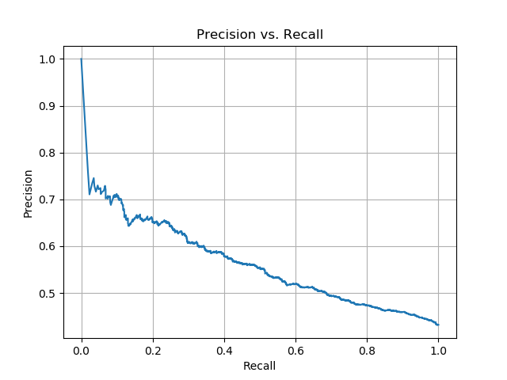

# pytorch-cnn-re
PyTorch version Relation Extraction codes on SemEval2010-Task8

## Usage
```bash
$ python src/train.py # to train the model
$ python src/test.py # to test the result
```

## Performance
```
                           precision    recall  f1-score   support

  Product-Producer(e2,e1)     0.0000    0.0000    0.0000       123
                    Other     0.2080    0.6432    0.3143       454
 Member-Collection(e1,e2)     0.0000    0.0000    0.0000        32
 Content-Container(e1,e2)     0.7273    0.8366    0.7781       153
  Product-Producer(e1,e2)     0.0000    0.0000    0.0000       108
     Entity-Origin(e2,e1)     0.0000    0.0000    0.0000        47
 Member-Collection(e2,e1)     0.7233    0.9104    0.8062       201
     Message-Topic(e2,e1)     0.0000    0.0000    0.0000        51
 Content-Container(e2,e1)     0.7097    0.5641    0.6286        39
   Component-Whole(e2,e1)     0.4412    0.6000    0.5085       150
   Component-Whole(e1,e2)     0.7534    0.6790    0.7143       162
Entity-Destination(e2,e1)     0.0000    0.0000    0.0000         1
     Message-Topic(e1,e2)     0.0000    0.0000    0.0000       210
     Entity-Origin(e1,e2)     0.5505    0.5166    0.5330       211
Entity-Destination(e1,e2)     0.7738    0.8110    0.7919       291
 Instrument-Agency(e1,e2)     0.0000    0.0000    0.0000        22
      Cause-Effect(e2,e1)     0.0000    0.0000    0.0000       194
 Instrument-Agency(e2,e1)     0.0000    0.0000    0.0000       134
      Cause-Effect(e1,e2)     0.0000    0.0000    0.0000       134

                 accuracy                         0.4306      2717
                macro avg     0.2572    0.2927    0.2671      2717
             weighted avg     0.3343    0.4306    0.3619      2717

TEST >>> ACC: 0.4306, Precision: 0.4306, Recall: 0.4306, F1-micro: 0.4306, F1-macro: 0.2671

TEST >>> AUC: 0.5645
```



## TODO

- Hyperparameter tuning for higher performance
- GPU support
- logging utils
- timer utils
